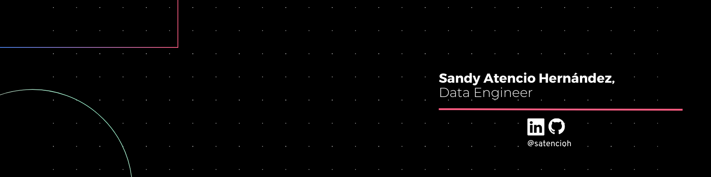

<h2>👋 Hi, I’m Sandy Atencio</h2>
Welcome to my repository, I'm an enthusiast of collective learning and communities. I currently work as a Data Engineer and I firmly believe in the power of data.

<h3>✔️ My Skills</h3>

- 🐍 Python
- 🛢️ SQL
- 📊 Power BI
- ☁️ AWS
<h3> 🤝 Volunteering </h3>

I'm volunter in the communities:
- [AWS Wommen Colombia](https://www.instagram.com/awswomencolombia/)
- <h4> 🪄👩‍💻 AWS Community Builder Category Data </h4>
<!---
satencioh/satencioh is a ✨ special ✨ repository because its `README.md` (this file) appears on your GitHub profile.
You can click the Preview link to take a look at your changes.
--->
